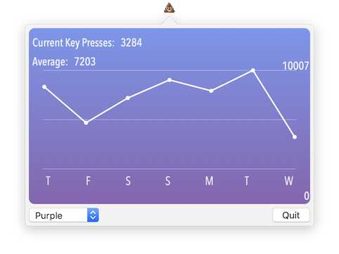

# Keyboard Activity Tracker
Mac menubar app to monitor daily keystrokes and trends

Simple menubar app that uses [NSEvent global monitoring](https://developer.apple.com/documentation/appkit/nsevent/1535472-addglobalmonitorforevents) to track number of keystrokes.
This data is stored is persisted in a Core Data database. Data is presented in popover featuring last 7 days keystroke count and average.